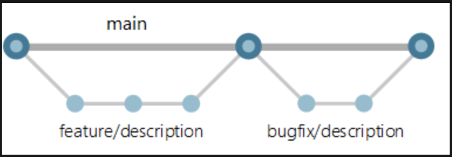

# Introduction
# Why am here
# Github
# Scheduling 1:1
# Assignment feedback 
## Core assgnments 90% more in good standing
## Belt Exams
### orange 8 - 9.49 with 24 hours
### red 8 - 9.49 within 5 hours
### black 9.5+ within 5 hours
## Discussion questions
### How attendance is tracked - mandatory

Welcome to the Coding Dojo Python course.
1. In this repository I will be adding notes and test code for each lecture, and other things as needed.
2. You can use the repository as reference.
3. README files are a great reference to the code and should clearly describe what is going on.
4. Writing is a tough thing, well at least it is for me. Write clear and concise descriptions in the README file because it will help in at least two ways.
5. The first way is by putting what you are doing into words on paper. This will help make the path clearer for you.
6. The second way is for other developers who need to work on the same code.
7. If you have not, please create your own github repository. You will need to work in your repository and commit your changes daily.
8. I am going to do my best to help you think like a developer.
9. There will be one python file per week and inside the file all of the notes and code for three lectures
10. Example is the first week file name is week_one.py
11. Under week_one.py there will be three sections lecture 1, lecture 2 and lecture 3

Like a developer:
1. Git pull the code # This will pull down the main code
2. Create a branch
3. Work from that branch
4. Commit and push your branch
5. Do a pull request so the lead developer can check and accept/deny your code
6. Merge your code to the main branch

Branching Strategy 

